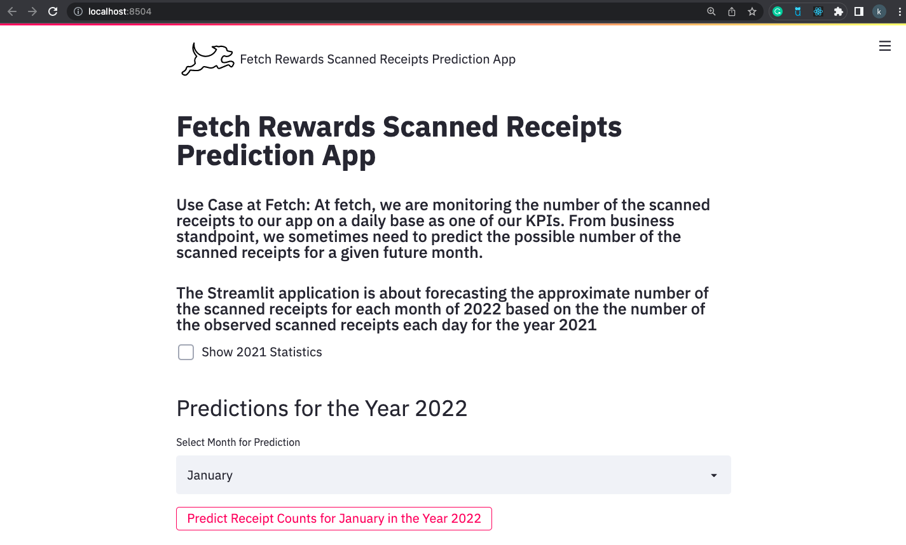
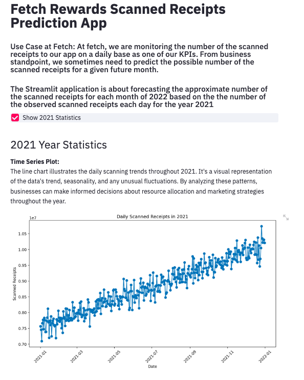
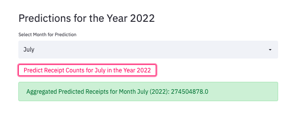

# Fetch Rewards Scanned Receipts Prediction App

## Project Overview

#### Fetch Use Case: At fetch, we are monitoring the number of the scanned receipts to our app on a daily base as one of our KPIs. From business standpoint, we sometimes need to predict the possible number of the scanned receipts for a given future month.

This project is designed to predict the number of receipts that will be scanned by Fetch Rewards app users. The prediction is based on historical data from the year 2021 and uses machine learning models to estimate future counts.





## Models Used

- **Linear Regression**: A baseline model for initial prediction attempts. (Selected as a model for Predictions for the year 2022).
- **LSTM (Long Short-Term Memory)**: An advanced neural network model suited for time-series prediction.
- **ARIMA/SARIMA**: Traditional time-series forecasting models used for comparison with LSTM results.

## Data

The data used for this project consists of daily counts of receipts scanned by users throughout 2021. The data has 1 target variable i.e. the daily counts of receipts scanned along with that respective date. We used DateTime to convert the dates into a proper format and also have increased some features for better performance of the models. 

## Batch Processing

To reduce the complexity involved while working with a Streamlit app/Flask app, as we need to have all the month's predictions, the model is designed to run batch predictions for the entire year of 2022. It uses features generated from the 2021 dataset to make future predictions. All the 2022 results are saved into the "predicted_receipt_counts_2022.csv", where in the main streamlit application, we can just import that directly and aggregate the results.

## Installation of our Prediction app:

To install the project, follow these steps:

1. Clone the repository to your local machine:
    ```
    git clone https://github.com/kaushik-42/Fetch_App
    ```

2. Navigate to the project directory:
    ```
    cd Fetch_APP
    ```

## Running the App

### With Docker:

1. Ensure you have Docker installed on your machine.
2. Clone the repository and navigate to the project directory.
3. Build the Docker image:
   ```
    docker build -t fetch_app:latest
   ```
4. Run the Docker container:
   ```
    docker run -p 8504:8504 fetch_app:latest
   ```
5. You can also visit `http://localhost:8504` to view the app.

### Without Docker:

1. Ensure you have Python and the necessary packages installed.
2. Clone the repository and navigate to the project directory.
3. Install the required packages: pip install -r requirements.txt
   ```
   pip install -r requirements.txt
   ```
4. Run the Streamlit app: streamlit run app.py
   ```
   streamlit run app.py
   ```
5. Streamlit will automatically open the app in your default web browser.


## Running the .ipynb file:

After cloning the above link, also please navigate to the "Fetch_ML.ipynb", where I did all the Pipeline way from Data Collection, pre-processing, feature engineering, Experimenting with various algorithms (The Fun part! :)), Training, Validation till Predictions(Batch Processing of all the results day by day). To reduce the complexity of the app, I have batch processed all the results from the Fetch_ML.ipynb notebook into a .csv file, and I have used that file by providing aggregations on the months data for providing the user requested month prediction. The output will be a csv file of all the 2022 predictions of all the data points!
 

## Features

- Interactive Streamlit dashboard for data visualization for the Year 2021 if the shareholders want to view that before making 2022 predictions of a month.
- Monthly aggregated plot for understanding trends over 2021.
- Batch prediction capability for forecasting the entire year of 2022.

## Metrics used:

- Rmse (Root Mean Square Error) - LSTM's and Linear regression was performing well.
- MAE (Mean Absolute Error) - Linear Regression was working really well.

## Future Improvements

Several enhancements can be made to this project to increase the accuracy of the predictions and the usability of the application:

- **Improved LSTM Model**: With access to more computational resources, the LSTM model could be fine-tuned with a larger dataset, more epochs, and hyperparameter optimization to improve its forecasting ability.

- **Deployment Service**: Developing a deployment pipeline using services like AWS, Google Cloud, or Azure for easy model retraining and automatic updates of the predictive model.

- **Extended Modeling**: Dedicate additional time to experimenting with different modeling techniques, including hybrid models that combine the strengths of neural networks and traditional statistical models.

- **Feature Engineering**: Investigate more complex features and external data sources that could influence receipt scanning behavior, such as marketing campaigns, seasonal effects, or user demographics.

- **User Feedback Integration**: Implement a feedback loop in the application that allows users to provide data on the accuracy of the predictions, which can be used to further refine the models.

## Acknowledgements

I would like to extend my sincerest gratitude to Fetch Rewards for providing this incredible learning opportunity. This exercise has been instrumental in enhancing my understanding of machine learning workflows, from data preprocessing and modeling to deployment and user interface design. The experience has been both challenging and rewarding, offering a comprehensive platform to apply theoretical knowledge to a practical, real-world problem.

I would be grateful If I get an Interview opportunity with Fetch!

## Contributing

We welcome contributions to improve the models or the app interface. Please feel free to fork the repository, make changes, and submit a pull request.

## License

This project is licensed under the MIT License - see the LICENSE file for details.
